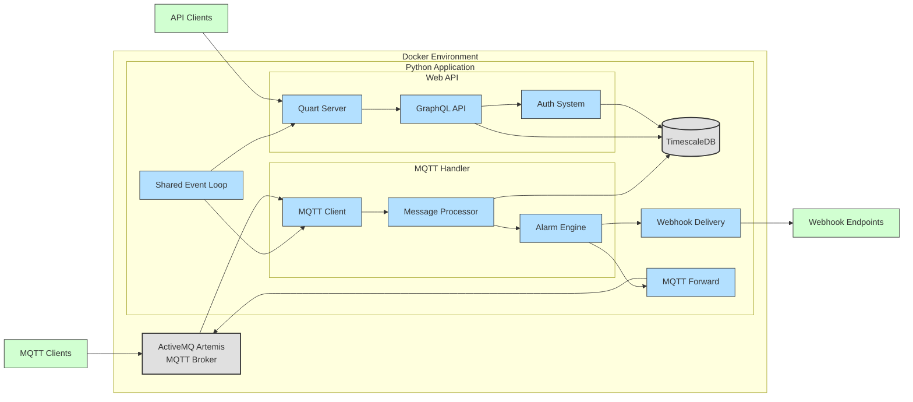

# MQTT Logger

Subscribes to MQTT topics, stores messages in a TimescaleDB (Postgres) time-series database, and exposes a GraphQL API for configuration, querying, and alarm management.

- Stores message payloads as `TEXT` and additionally parses valid JSON into a `JSONB` column via a database trigger
- Automatic data retention (90 days) and compression (7 days) via TimescaleDB policies
- Alarm system with [Standard Webhooks](https://www.standardwebhooks.com/) delivery (signed HTTP POST) or MQTT filter/forward (republish to a new topic)
- JWT authentication on all API endpoints

## Quick Start

```bash
docker compose up --build
```

This starts three containers: ActiveMQ Artemis, TimescaleDB, and the Quart application. The GraphiQL interface is available at http://localhost:5000/graphql/.

Default credentials (see `.env`):
- GraphQL API: `admin@agritheory.dev` / `ohch4GeiSie`
- Artemis: `artemis` / `artemis`

See [docs/index.md](./docs/index.md) for full configuration reference and API documentation.

## Infrastructure



## TLS

### Generating Certificates

This example uses Let's Encrypt. If you have existing certificates, skip to step 2.

```bash
sudo certbot certonly --standalone -d your.domain.com
```

### Configuring Artemis for TLS

Artemis uses a Java Keystore (`.jks`). Convert your certificates:

```bash
# 1. Convert PEM to PKCS12
sudo openssl pkcs12 -export -out fullchain.p12 \
  -in /etc/letsencrypt/live/your.domain.com/fullchain.pem \
  -inkey /etc/letsencrypt/live/your.domain.com/privkey.pem \
  -name "le_cert"

# 2. Import into a Java keystore
sudo keytool -importkeystore \
  -deststorepass <password> -destkeypass <password> \
  -destkeystore le_keystore.jks \
  -srckeystore fullchain.p12 -srcstoretype PKCS12 -srcstorepass <export_password>
```

Place `le_keystore.jks` in a `certs/` directory and configure `docker-compose.prod.yml` and `etc-override/broker.xml` with the keystore path and password.

### Renewing Certificates

```bash
sudo certbot renew

# Remove old cert from keystore
sudo keytool -delete -alias le_cert -keystore ./le_keystore.jks

# Re-import (same steps as above)
```

## Testing

```bash
poetry run pytest
```

No external services need to be started — the test suite uses [testcontainers](https://testcontainers-python.readthedocs.io/) to provision TimescaleDB and ActiveMQ Artemis automatically. Docker must be available on the host.

See [test/test.md](./test/test.md) for a full description of each test module.

## Generating Cryptographic Keys

```bash
# Fernet key (encrypts stored broker passwords)
poetry run python -c "from cryptography.fernet import Fernet; print(Fernet.generate_key().decode())"

# JWT secret
poetry run python -c "import secrets; print(secrets.token_urlsafe(32))"
```

## Database Maintenance

Consider running `VACUUM ANALYZE` on a periodic schedule (e.g. cron) to reclaim storage from dead tuples. TimescaleDB compression and retention policies handle time-series data automatically.

## Attributions

Forked from [mqtt-pg-logger](https://github.com/rosenloecher-it/mqtt-pg-logger) by [Raul Rosenlöcher](https://github.com/rosenloecher-it), MIT licensed.
